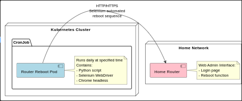

# Home router {KAON_TELEKOM} restarter in k8s scheduled job

Open the router admin page with selenium webdriver. Logins with the appropriate credentials. Navigate to reboot submenu and click the "Reboot" button.



## Development

```bash
readme.excalidraw
readme.plantuml
.gitignore
.dockerignore
pyenv install 3.9.18
pyenv versions
pyenv local 3.9.18 # .python-version
# direnv, echo 'eval "$(direnv hook bash)"' >> ~/.zshrc
echo 'layout pyenv 3.9.18' > .envrc
direnv allow
source .direnv/python-3.10/bin/activate
# THIS doesnt need if .envrc/direnv is used
# python -m venv .venv
# source .venv/bin/activate
pip install -r requirements.txt
touch .env
GH action https://github.com/python-semantic-release/python-semantic-release
GH readme.md https://github.com/othneildrew/Best-README-Template

```

### 0. Install ChromeDriver
Selenium needs ChromeDriver to control the browser.

```bash
sh tools/Linux64.sh
```

### 1. .env file for Local Development
Create a .env file in the same directory as main.py:

```bash
ROUTER_URL=http://CHANGE_IP
ROUTER_USERNAME=admin
ROUTER_PASSWORD=****
GITHUB_TOKEN=****
```

### 2. main.py

```bash
pip install -r requirements.txt
```

### 3. Dockerfile (No .env in Production)

📌 Note:

Locally: It loads environment variables from .env.

In Kubernetes: It fetches secrets from Kubernetes Secrets via environment variables.

## Deployment

### 4. Docker building

Authenticating to GitHub Package Registry
```bash
echo $GITHUB_TOKEN | docker login ghcr.io -u {your_user_name} --password-stdin
```

Authenticating kubernetes to GitHub Package Registry
```bash
kubectl create secret docker-registry regcred -n tools --docker-server=ghcr.io --docker-username={your_user_name} --docker-password=$GITHUB_TOKEN

kubectl get secret regcred --output=yaml

kubectl get secret regcred --output="jsonpath={.data.\.dockerconfigjson}" | base64 --decode
```

Build and push the Docker image:
```bash
docker build -t ghcr.io/{your_user_name}/fluffy-fortnight/reboot-router .
docker tag 3541d480fc19 ghcr.io/{your_user_name}/fluffy-fortnight/reboot-router:latest
docker push ghcr.io/{your_user_name}/fluffy-fortnight/reboot-router:latest
```

Steps to link library to repo
```bash
Go to your profile on GitHub https://github.com/{your_user_name}?tab=packages. you must see the list of packages like here. List of packages

Click on the package that you need to link to repo. You must get link to repo or go to this link https://github.com/users/{your_user_name}/packages/npm/{your_package_name}/settings

Select the library repo.

You can now view the packages on the repo too.
https://github.com/{your_user_name}?tab=packages
```

Now the script runs headlessly using WebDriver Manager, ensuring the correct ChromeDriver version is used. 🚀

### 5. Kubernetes CronJob (router-reboot-cronjob.yaml) and secret

Apply the CronJob to Kubernetes:
```bash
kubectl apply -f router-reboot-cronjob.yaml

kubectl apply -f router-reboot-secret.yaml
```

Now the script runs headlessly using WebDriver Manager, ensuring the correct ChromeDriver version is used. 🚀


### 6. Run Locally

Replace the base64 values with your actual credentials by encoding them:
```bash
echo -n "your-router-password" | base64
export ROUTER_PASSWORD=your-base64-encoded-router-password
export ROUTER_URL=https://CHANGE_IP
export ROUTER_USERNAME=admin
export GITHUB_TOKEN=****
python main.py

Or use

source .env && python main.py
```

## Contributing

Pull requests are welcome. For major changes, please open an issue first
to discuss what you would like to change.

Please make sure to update tests as appropriate.

## License

[MIT](https://choosealicense.com/licenses/mit/)
